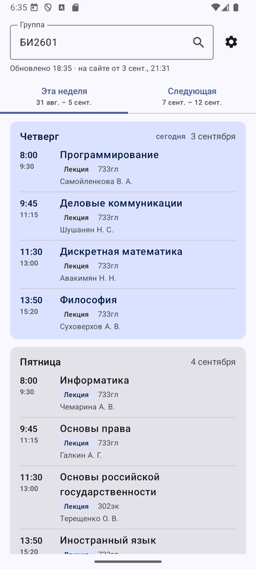
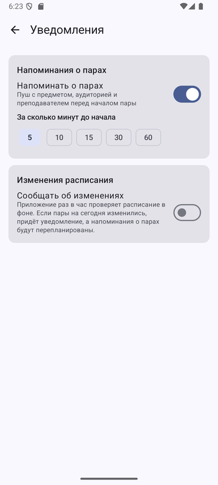
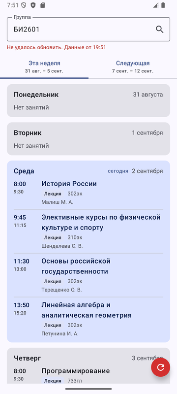
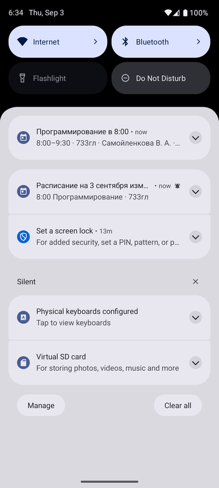

<p align="center"></p>

# Расписание КубГАУ

Android-приложение с расписанием пар Кубанского государственного аграрного университета.
Один экран, поиск по группе, работа офлайн, напоминания о парах и фоновая проверка изменений.


[](https://github.com/JohnTheChief/kubsau-schedule4j)

## Скриншоты

| Расписание | Настройки | Без сети | Уведомления |
|:---:|:---:|:---:|:---:|
|  |  |  |  |
| Прокрутка к сегодняшнему дню | Напоминания и изменения | Сохранённые данные и кнопка повтора | Напоминание о паре и уведомление об изменении |

## Возможности

- **Поиск по группе.** Подсказки с сайта при вводе, поиск по кнопке или клавише «Найти» на клавиатуре.
- **Две недели.** Текущая и следующая неделя на вкладках, сегодняшний день подсвечен, при запуске список сразу проматывается к нему.
- **Офлайн.** Последний результат сохраняется. При запуске он показывается мгновенно, затем начинается обновление.
- **Повтор по нажатию.** Если обновление не удалось, справа внизу появляется красный кружок. Нажатие повторяет запрос, автоповторов нет.
- **Напоминания о парах.** Пуш за 5, 10, 15, 30 или 60 минут до начала: предмет, время, аудитория, преподаватель.
- **Фоновая проверка.** Раз в час приложение сверяет расписание с сайтом. Если пары на сегодня изменились, приходит уведомление, а напоминания перепланируются.
- **Живая иконка.** Когда расписание изменилось в фоне, иконка приложения меняется на красную. После захода в приложение возвращается обычная.

## Структура проекта

```
app/src/main/java/me/heyjohn/kubsauschedule/
├── MainActivity.kt              экран расписания или настроек, возврат обычной иконки
├── App.kt                       репозиторий, каналы уведомлений, запуск фоновой задачи
├── ScheduleViewModel.kt         состояние экрана, поиск, подсказки, повтор
├── AppIconSwitcher.kt           переключение activity-alias
├── data/
│   ├── KubSauApi.kt             HTTP-запросы, разбор через библиотеку
│   ├── ScheduleCache.kt         кэш HTML и метаданных
│   ├── ScheduleRepository.kt    загрузка, кэш, сравнение, будильники, пуши
│   └── SettingsStore.kt         настройки уведомлений
├── notifications/
│   ├── Notifications.kt         каналы и тексты уведомлений
│   ├── LessonAlarmScheduler.kt  будильники на пары
│   ├── LessonAlarmReceiver.kt   показ напоминания
│   └── BootReceiver.kt          восстановление будильников
├── work/
│   └── ScheduleRefreshWorker.kt фоновое обновление
└── ui/
    ├── ScheduleScreen.kt        поле поиска, вкладки недель, карточки дней
    └── SettingsScreen.kt        настройки уведомлений и разрешения
```

## Сборка

Требуются Android Studio с Android SDK 37 и JDK 17 или новее. Библиотека подключается с JitPack,
репозиторий уже прописан в `settings.gradle.kts`.

```bash
./gradlew :app:assembleDebug
```

Установка на подключённое устройство или эмулятор:

```bash
./gradlew :app:installDebug
```

## Тесты

Инструментальные тесты ходят на реальный сайт, поэтому устройству нужен интернет.

```bash
./gradlew :app:connectedDebugAndroidTest
```

| Тест | Что проверяет |
|---|---|
| `ScheduleScreenTest` | Ввод группы с клавиатуры, появление расписания и подсказок |
| `BackgroundRefreshTest` | Фоновый воркер замечает изменение пар на сегодня, шлёт уведомление, меняет иконку и перепланирует будильники; напоминание о паре показывается |

Чтобы приложение осталось установленным после тестов:

```bash
./gradlew :app:connectedDebugAndroidTest -Pandroid.injected.androidTest.leaveApksInstalledAfterRun=true
```

## Разрешения

| Разрешение | Зачем |
|---|---|
| `INTERNET` | Запросы к `s.kubsau.ru` |
| `POST_NOTIFICATIONS` | Напоминания о парах и уведомления об изменениях, запрашивается в настройках |
| `SCHEDULE_EXACT_ALARM` | Точные будильники на пары. На Android 13+ выдаётся пользователем, приложение предложит открыть системные настройки. Без него напоминания приходят с небольшой задержкой |
| `RECEIVE_BOOT_COMPLETED` | Восстановление будильников после перезагрузки |

## Ограничения

- Время пар считается в часовом поясе устройства.
- Период фоновой проверки в один час приблизительный: в режиме энергосбережения система может отложить запуск.

## Благодарности

- [kubsau-schedule4j](https://github.com/JohnTheChief/kubsau-schedule4j) за разбор расписания и модель данных.
- Логотип принадлежит [Кубанскому государственному аграрному университету](https://kubsau.ru).
